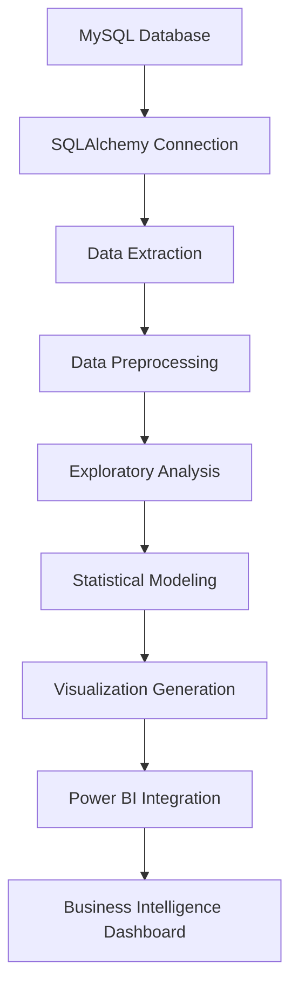

# 🛒 Shopping Trends Analytics

[](https://www.python.org/)
[](https://www.mysql.com/)
[](https://pandas.pydata.org/)
[](https://powerbi.microsoft.com/)
[](https://jupyter.org/)
[](LICENSE)

> **A comprehensive data analytics solution for understanding customer shopping behavior, purchasing patterns, and market trends using advanced database-driven analytics and interactive business intelligence dashboards.**

## 🎯 Project Overview

This project delivers an end-to-end analytics solution for retail business intelligence, combining **MySQL database management**, **Python data analysis**, and **Power BI visualization** to extract actionable insights from customer shopping behavior. The analysis covers 3,900 customer transactions across 19 different attributes, providing deep insights into demographics, purchasing patterns, and revenue optimization opportunities.

### 🔬 Key Features

- **Database-Driven Analytics**: MySQL integration with SQLAlchemy for robust data management
- **Comprehensive EDA**: 8 thematic analysis areas covering all business aspects
- **Interactive Dashboards**: Multi-page Power BI reports with dynamic filtering
- **Advanced Visualizations**: 30+ professional charts and statistical plots
- **Business Intelligence**: Actionable insights for marketing and inventory optimization
- **Clean Data Pipeline**: Automated data preprocessing and quality assurance

## 📊 Dataset Overview

- **Source**: Retail transactions database (`shopping_trends_db`)
- **Size**: 3,900 customer records
- **Features**: 19 comprehensive attributes
- **Quality**: 100% complete dataset with no missing values

## 🏗️ Architecture

### Data Processing Pipeline


### Technical Stack
- **Database**: MySQL Server for data storage and management
- **Backend**: Python with pandas, numpy for data processing
- **Visualization**: Matplotlib, Seaborn for statistical plots
- **Business Intelligence**: Power BI Desktop for interactive dashboards
- **Development**: Jupyter Notebook for analytical workflow

## 📈 Analysis Framework

### 8 Core Analysis Areas

| Analysis Area | Focus | Key Metrics |
|---------------|-------|-------------|
| **Customer Behavior** | Demographics & engagement | Age distribution, gender split, subscription rates |
| **Purchase Analysis** | Product performance | Top categories, seasonal trends, size preferences |
| **Payment & Shipping** | Transaction methods | Payment preferences, shipping choices, costs |
| **Discounts Impact** | Promotional effectiveness | Discount usage, impact on purchase amounts |
| **Customer Satisfaction** | Quality metrics | Review ratings, category satisfaction |
| **Demographic Insights** | Behavioral segmentation | Age group preferences, gender patterns |
| **Product Preferences** | Item-level analysis | Color trends, size distribution, category matrix |
| **Revenue Analytics** | Financial performance | Total revenue, AOV, geographic distribution |

## 💡 Key Business Insights

### Revenue Performance
- **Total Revenue**: $233,081 across all transactions
- **Average Order Value**: $59.76 per transaction
- **Top Category**: Clothing dominates with highest sales volume
- **Geographic Leaders**: California, Texas, and New York lead in revenue

### Customer Behavior
- **Age Demographics**: Primary customer base aged 25-45
- **Gender Balance**: Nearly equal split between male and female customers
- **Purchase Frequency**: Monthly purchasers represent the largest segment
- **Subscription Rate**: 51.2% of customers maintain active subscriptions

### Product Insights
- **Seasonal Patterns**: Strong seasonal variations in category preferences
- **Size Distribution**: Medium (M) and Large (L) sizes most popular
- **Color Trends**: Olive, Silver, and Yellow lead in popularity
- **Rating Average**: 3.75/5.0 overall customer satisfaction

## 📁 Project Structure

```
Shopping-Trends-Analytics/
│
├── 📓 Notebook/                          # Complete analytical workflow
│   ├── shopping-trends-comprehensive-analysis.ipynb
│   └── README.md
│
├── 📊 Dataset/                           # Data sources and documentation
│   ├── shopping_trends.csv
│   ├── Dataset.md
│   └── sql/
│       └── setup_shopping_trends.sql
│
├── 📈 Results/                           # Generated visualizations
│   ├── Customer Age Distribution.png
│   ├── Revenue by Category.png
│   ├── Payment Method Analysis.png
│   ├── Seasonal Purchase Patterns.png
│   └── ... (25+ additional visualizations)
│
├── 🎨 Power BI/                          # Business intelligence dashboards
│   ├── ShopTrends Analytics Dashboard.pbix
│   ├── ShopTrends Analytics Dashboard.pdf
│   ├── shopping_trends_clean.xlsx
│   └── README.md
│
├── 📋 README.md
└── 📜 LICENSE
```

## 🎨 Power BI Dashboard

### 4 Interactive Report Pages

#### 1. **Overview Page**
- Key Performance Indicators (KPIs)
- Sales trends by purchase frequency
- Category distribution analysis
- Top-performing states visualization

#### 2. **Customers Page** 
- Demographic breakdowns by age and gender
- Subscription status analysis
- Purchase behavior patterns
- Payment method preferences

#### 3. **Products Page**
- Category and seasonal performance
- Color and size preference analysis
- Product rating insights
- Seasonal performance matrix

#### 4. **Locations Page**
- Interactive sales map by state
- Geographic revenue distribution
- Regional shipping preferences
- Location-based operational metrics

## 🏪 Business Applications

### Strategic Decision Making
- **Inventory Management**: Optimize stock levels based on seasonal and demographic trends
- **Marketing Campaigns**: Target specific age groups and geographic regions
- **Pricing Strategy**: Understand price sensitivity across customer segments
- **Customer Retention**: Identify high-value customer characteristics

### Operational Insights
- **Supply Chain**: Optimize shipping methods based on customer preferences
- **Payment Processing**: Streamline preferred payment options
- **Promotional Strategy**: Maximize discount effectiveness and timing
- **Geographic Expansion**: Identify underserved markets with high potential

## 📊 Sample Visualizations

### Statistical Analysis
- **Age Distribution**: Histogram with KDE overlay showing customer age patterns
- **Revenue Analysis**: Category-wise revenue breakdown with geographic mapping
- **Correlation Matrix**: Relationship analysis between numerical variables
- **Seasonal Trends**: Time-series analysis of purchasing patterns

### Business Intelligence
- **Customer Segmentation**: Age group and gender-based behavioral analysis
- **Product Performance**: Top-selling items with profitability metrics
- **Geographic Heat Maps**: State-wise sales performance visualization
- **Payment Analytics**: Method preferences with demographic overlays

## 🤝 Contributing

Feel free to suggest improvements, fix bugs, or add new features.  
Thanks for your support.

## 📞 Contact

**Ahmed Maher Abd Rabbo**
- 💼 [LinkedIn](https://www.linkedin.com/in/ahmed-maherr/)
- 📊 [Kaggle](https://kaggle.com/ahmedmaherabdrabbo)
- 📧 Email: ahmedbnmaher1@gmail.com
- 💻 [GitHub](https://github.com/AhmedMaherAbdRabbo)

## 📜 License

This project is licensed under the MIT License - see the [LICENSE](LICENSE) file for details.
